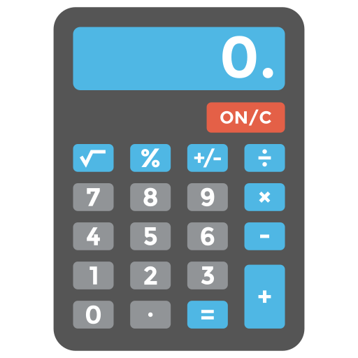

# Formula-Plus
Программное обеспечение для математических и физических вычислений




## Установка проекта (Windows)
У вас должны быть установлены [зависимости проекта](https://github.com/DSD-Games/Formula-Plus#зависимости)

1. Клонирование репозитория или через программное обеспечение GitHub

```git clone https://github.com/DSD-Games/Formula-Plus.git```

2. Переход в директорию PhysicalCalculator
3. Находим файл с расширением .pro по пути 

```"Formula-Plus\src"```

4. Запуск файла ```"Formula-Plus.pro"```  с помощью IDE Qt Creater

5. Все готово к дальнейшей работе !

## Запуск (Windows)
1. Переходим по пути
```"Build/release/"```
1. Запускаем файл  ```"Formula-Plus.exe"```
2. Все готово, можно пользоваться !

## Функции
- Стандартная функциональность калькулятора, которая предлагает основные операции и выполняет команды сразу после их ввода.
- Функциональность физического калькулятора, которая предлагает физические формулы и операции над ними, производит необходимые расчеты. С доходчивым объяснением и картинками
   - Второй закон Ньютона
   - Закон Архимеда
   - Максимум и миниму интерфенции
   - Закон Ома
   - Сила Ампера
   - Относительность массы
   - Кинетическая энергия
   - Сила Кулона
   - Сила Лоренца
   - Частота колебаний
   - Закон Томсана
   - Период колебания пружинного маятника
   - Путь при свободном падении тела
   - Скорость свободного падения
   - Период полураспада
   - Длина волны
   - Средняя скорость
   - Абсолютная температура
   - Количество вещества
   - Концентрация молекул
   - Скорость распространения волны
   - Координата в момент времени t
   - Дальность полета по горизонтали
   - Потенциальная энергия
   - Сила тяжести
   - Количество выделяемой теплоты
   - Плавления тела
   - Теплота парообразования
   - Горение топлива
   - Удельное сопротивление проводника
- Функциональность построения графиков, которая предлагает основные графики и выполняет команды сразу после их ввода.
   - Линейны график
   - Параболла

## Документация
Добро пожаловать в документацию Formula Plus! Просто начните работу, после изучения [*Документации*](Documentation/ru/index.md). Formula Plus был образован на Framework Qt Creator, на языке программирования C++. Вам не хватает некоторых решений в Formula Plus ? Тогда присоединяйтесь к нам, чтобы дополнить приложение новыми функциями.

## Поддержка
Если у вас возникли сложности или вопросы по использованию приложения, создайте 
[обсуждение](https://github.com/DSD-Games/Formula-Plus/issues/new/choose) в данном репозитории или напишите на электронную почту <den4oman@mail.ru>.

## Зависимости
Эта программа зависит от компилятора Desktop Qt MinGW 64-bit или 32-bit версии 5.14.2 или выше. Если вы заметили, что данное ПО можно запустить на версии ниже, или он не работает на какой-либо версии, то напишите в [поддержку](https://github.com/DSD-Games/Formula-Plus#поддержка)
## Языки
Данное приложение реализуется на таких языках:
  - русский

## Описание коммитов
| Название | Описание                                                        |
|----------|-----------------------------------------------------------------|
| build	   | Сборка проекта или изменения внешних зависимостей               |
| sec      | Безопасность, уязвимости                                        |
| docs	   | Обновление документации                                         |
| feat	   | Добавление нового функционала                                   |
| fix	   | Исправление ошибок                                              |
| perf	   | Изменения направленные на улучшение производительности          |
| refactor | Правки кода без исправления ошибок или добавления новых функций |
| revert   | Откат на предыдущие коммиты                                     |